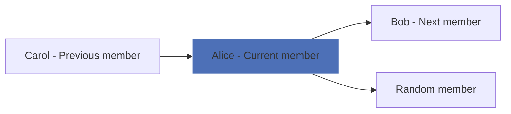

<h1 align="center">
  <a href="https://ourwebr.ing" target="_blank"></a>
</h1>
<p align="center"><strong>🌐 A lightweight webring to link cool websites together.</strong></p>

<p align="center">
<a href="#-what-is-it">What is it?</a> •
<a href="#-how-it-works">How it works</a> •
<a href="#-joining">Joining</a> •
<a href="#-contributors">Contributors</a>
</p>

## 🌟 What is it?

This is a **simple webring** for people who want to link their personal websites together.  

## 💡 How it works

- Each member has their own website.  
- The webring provides links to **Next**, **Previous**, and **Random** sites.  
- You can display the webring widget anywhere on your site.  
- A simple [JSON](https://github.com/fr0st-iwnl/webring/blob/master/members.json) file keeps track of all members.

## 🔗 Navigation

There are **three types of links** in the webring:

| Link | What it does |
|------|-------------|
| `prev.html?name=<yourname>` | Goes to the **previous member**.|
| `next.html?name=<yourname>` | Goes to the **next member**. |
| `rand.html` | Goes to a **random member**. |

## 🗺 Navigation Flow (Mermaid Diagram)

Let's say you have **3 members** in the webring (***Alice***, ***Carol*** and ***Bob***):



## 📝 Joining

1. Have a personal website.  
2. Add the webring links to your site **(they have to be on the main page)**:
```html
<a href="https://fr0st-iwnl.github.io/webring/prev.html?name=<name>">⬅ Previous</a>
<a href="https://fr0st-iwnl.github.io/webring/">Webring</a>
<a href="https://fr0st-iwnl.github.io/webring/rand.html">🎲 Random</a>
<a href="https://fr0st-iwnl.github.io/webring/next.html?name=<name>">Next ➡</a>
```
3. Add yourself to the `members.json` file:
```json
{ "name": "yourname", "site": "https://yourwebsite.com" }
```
4. That's it! You're in the webring.

## 🤝 Contributors

This webring is open-source.
If you want to improve it, feel free to fork the repo and submit a pull request.

### Thank you!

<a href="https://github.com/fr0st-iwnl/webring/graphs/contributors">
  
</a>

